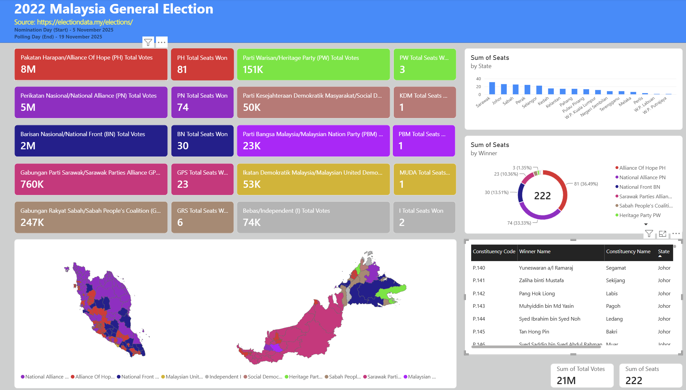
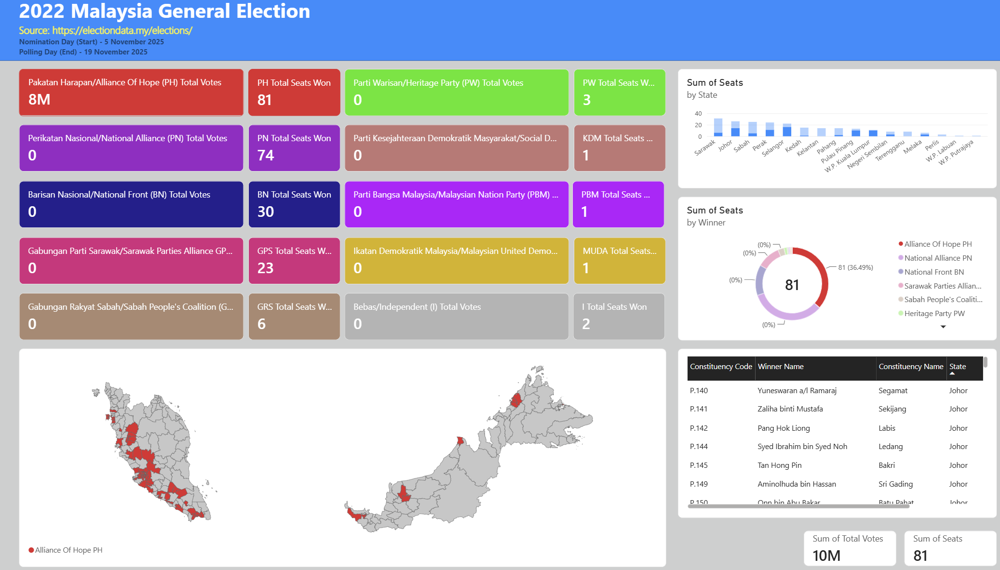
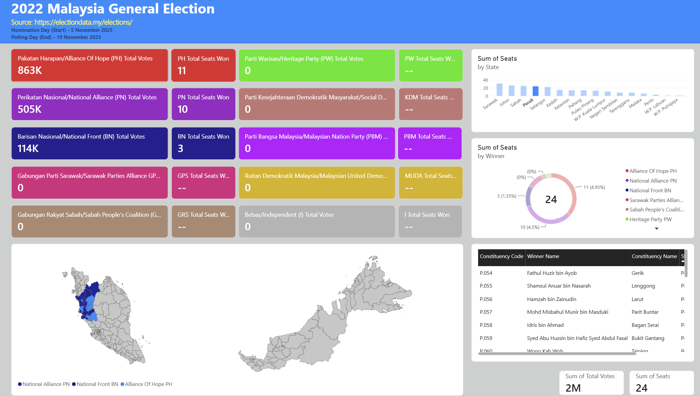

# 2022 Malaysia Election Power BI Analytic Dashboard

## Project Objectives
The Objectives of the Project is to create a analytical dashboard that can be used to see which party/coalitions has won the most votes in which regions of Malaysia. In addition it will also show the candidates that won the constituency and the party that they are affiliated to as it will also show it on the Map provided inside the dashboard.

## Dataset Used
Theva, T. (2026). Data catalogue [Data set]. ElectionData.MY. https://electiondata.my/data-catalogue/
Department of Statistics Malaysia. (2022). electoral_0_parlimen.geojson [Data set]. GitHub. https://github.com/dosm-malaysia/data-open/tree/main/datasets/geodata

## Questions (KPIs)
- Which Party won the most vote?
- Which Party won the most vote across all regions?
- Which State has the most vote?
- Which Candidate won the constituency they were campaigning in?
- Which Party won the most in a certain state?

## Dashboard Preview

## Conclusion
I'm Oguri Cap yo 
